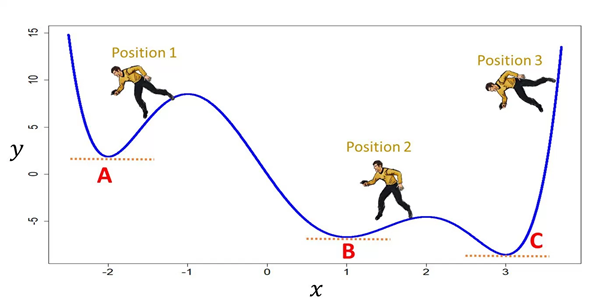
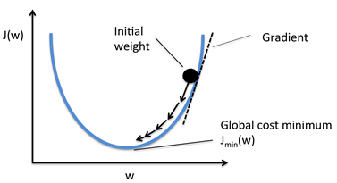
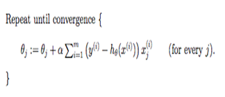
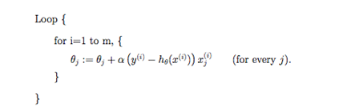
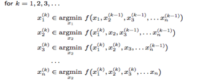

rcane
=====

[](https://travis-ci.org/sureshaks/rcane)

What is it?
-----------

An R package to find parameter estimates of Linear Regression

No seriously, what is it?
-------------------------

This is what we did...



A little more info



We start with arbitrary parameter estimates for linear regression and slide down to the optimal values.

But how?
--------

We use 4 different algorithms:

-   Batch Gradient Descent

-   Stochastic Gradient Descent

-   Mini-batch Gradient Descent

-   Coordinate Descent

### Time for some Math


<table rules="none">
<tr>
    <th> 
      Batch
    </th>
    <th> 
      Stochastic
    </th>
    <th>
      Coordinate
    </th>

</tr>
<tr>
    <td>
      
    </td>
    <td>
      
    </td>
    <td>
      
    </td>

</tr>
</table>
Package installation and usage
------------------------------

If you have R &gt;= 3.4.2, follow the instructions

1.  Open R studio and run this on the console

``` r
install_github("sureshaks/rcane")
```

1.  Nothing. You can just include it in the search path and use it

``` r
library(rcane)
?rlm
```

Who are we?
-----------

<table>
<tr>
    <td>Siddhesh Acharekar</td>
    <td>Shivayogi Biradar</td>
    <td>Hsiangwei Chao</td>
    <td>Akshay Suresh</td>

</tr>
</table>
