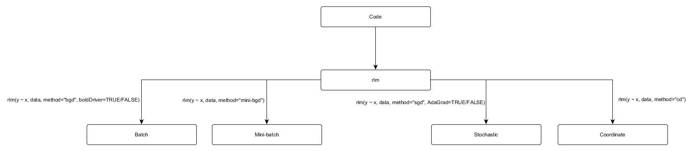

```{r setup, include = FALSE}
knitr::opts_chunk$set(
  collapse = TRUE,
  comment = "#>"
)
```


The goal of RCANE is to create an easy-to-use interface for gradient descent algorithms.

## Introduction

Rcane is a package which contains different numeric optimization algorithms for parameter estimation in linear regression.

4 algorithms are:

- Batch Gradient Descent

- Stochastic Gradient Descent

- Mini-batch Gradient Descent

- Coordinate Descent

Gradient descent is a first-order iterative optimization algorithm for finding minimum of a function. More information on Gradient Descent can be found [here](https://en.wikipedia.org/wiki/Gradient_descent)

## Package flow

The flow can be given as follows



```{r include, message=FALSE, warning=FALSE}
library(rcane)
```


## rlm for Batch Gradient Descent


### without boldDriver

```{r bgd, message=FALSE, warning=FALSE}
rlm(formula = Petal.Length ~ Petal.Width, data = iris, method = "bgd")
```


### with boldDriver
```{r bgdBoldDriver, message=FALSE, warning=FALSE}
rlm(formula = Petal.Length ~ Petal.Width, data = iris, method = "bgd", boldDriver = TRUE)
```

## rlm for Stochastic Gradient Descent

### without AdaGrad
```{r sgd, message=FALSE, warning=FALSE}
rlm(formula = Petal.Length ~ Petal.Width, data = iris, method = "sgd")
```


### with Adagrad
```{r sgdAda, message=FALSE, warning=FALSE}
rlm(formula = Petal.Length ~ Petal.Width, data = iris, method = "sgd", AdaGrad = TRUE)
```

## rlm for Mini-batch Gradient Descent
```{r mbgd, message=FALSE, warning=FALSE}
rlm(formula = Petal.Length ~ Petal.Width, data = iris, method = "mini-bgd")
```


## rlm for Coordinate Descent
```{r cd, message=FALSE, warning=FALSE}
rlm(formula = Petal.Length ~ Petal.Width, data = iris, method = "cd")
```

## coef
Get the coefficients of the model

```{r coef, message=FALSE, warning=FALSE}
bgd <- rlm(formula = Petal.Length ~ Petal.Width, data = iris, method = "bgd")
coef(bgd)
```

## fitted
Get the fitted values of the model

```{r fitted, message=FALSE, warning=FALSE}
bgd <- rlm(formula = Petal.Length ~ Petal.Width, data = iris, method = "bgd")
head(fitted(bgd))
```

## formula
Get the formula of the applied model

```{r formula, message=FALSE, warning=FALSE}
bgd <- rlm(formula = Petal.Length ~ Petal.Width, data = iris, method = "bgd")
formula(bgd)
```

## print
Print the coefficients of the model

```{r print, message=FALSE, warning=FALSE}
bgd <- rlm(formula = Petal.Length ~ Petal.Width, data = iris, method = "bgd")
print(bgd)
```

## resid
Get the residuals of the fitted model

```{r resid, message=FALSE, warning=FALSE}
bgd <- rlm(formula = Petal.Length ~ Petal.Width, data = iris, method = "bgd")
head(resid(bgd))
```

## predict
Apply the predictions on the new data set

```{r predict, message=FALSE, warning=FALSE}
bgd <- rlm(formula = Petal.Length ~ Petal.Width, data = iris, method = "bgd")
head(predict(bgd, newdata=iris))
```


## learning rate
This is the rate at which the algorithm would converge. The learning rate should be chosen carefully.
If the learning rate is too high, the algorithm would overshoot and never converge. If the learning rate is too low, the algorithm would get slower and not converge before max.iter iterations.

```{r lr, message=FALSE, warning=FALSE}
rlm(formula = Petal.Length ~ Petal.Width, data = iris, method = "bgd", alpha=0.2)
```

## max iterations
The function would terminate after <max.iter> iterations

```{r maxiterations, message=FALSE, warning=FALSE}
rlm(formula = Petal.Length ~ Petal.Width, data = iris, method = "bgd", alpha=0.2, max.iter = 500)
```

## precision
The function would terminate if the parameter estimates do not change by more than \<precision\> for a given iteration.

```{r precision, message=FALSE, warning=FALSE}
rlm(formula = Petal.Length ~ Petal.Width, data = iris, method = "bgd", precision = 0.0002)
```


## plotLoss
The function prints the loss function for each iteration

```{r plotLoss, message=FALSE, warning=FALSE}
bgd <- rlm(formula = Petal.Length ~ Petal.Width, data = iris, method = "bgd")
plotLoss(bgd)
```
